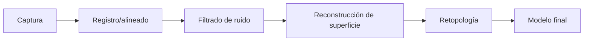

> [!summary]
> La adquisición de modelos 3D se realiza por edición manual o captura desde un objeto real. La elección impacta precisión, coste, tiempo y limpieza topológica del modelo final.

# Adquisición de modelos 3D

---

## Vías principales de adquisición

| Método | Ventaja | Riesgo/Coste |
|---|---|---|
| Edición manual | Control total de topología y detalle | Más tiempo de modelado |
| Captura 3D | Obtención rápida de geometría real | Ruido, huecos y postprocesado |

---

## Digitalizador manual

El operador recorre la superficie del objeto y muestrea puntos.

- Útil para captura puntual y piezas pequeñas.
- Dependiente del operador.
- Menor automatización.

> [!tip]
> Conviene combinarlo con retopología posterior si el destino es tiempo real.

---

## Digitalizador láser

Se basa en **luz estructurada** + **triangulación** para estimar coordenadas 3D.

### Ventajas
- Alta densidad de muestreo.
- Mejor repetibilidad.
- Captura de formas complejas.

### Limitaciones
- Sensible a materiales reflectantes/translúcidos.
- Puede generar nubes/mallas con ruido.
- Requiere limpieza y reconstrucción de superficie.

---

## Pipeline típico tras la captura

---

## Qué técnica usar según objetivo

| Objetivo | Recomendación |
|---|---|
| CAD de precisión | Edición manual + restricciones geométricas |
| Visualización rápida | Captura 3D + simplificación |
| Simulación física | Captura + limpieza topológica rigurosa |
| Real-time rendering | Captura + retopología + LOD |

---

## Conexiones con el temario

- [[Técnicas de Representación]]
- [[Requisitos de Representación]]
- [[Representación de Fronteras (B-Rep)]]
- [[Buffers (VAO, VBO, EBO)]]

