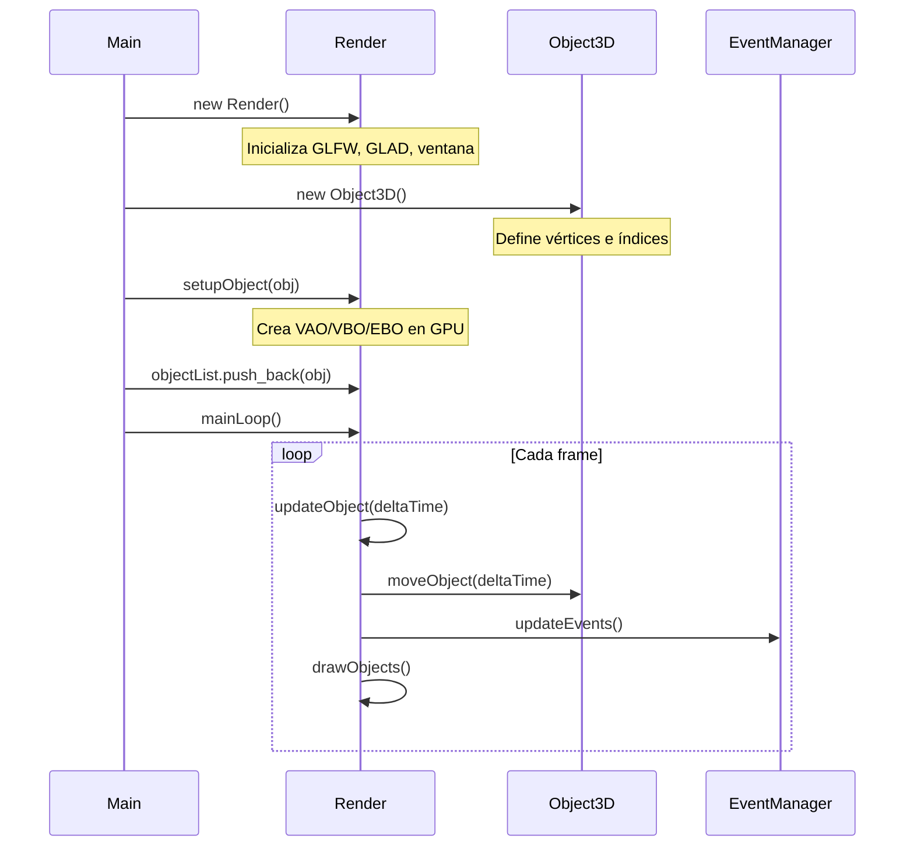
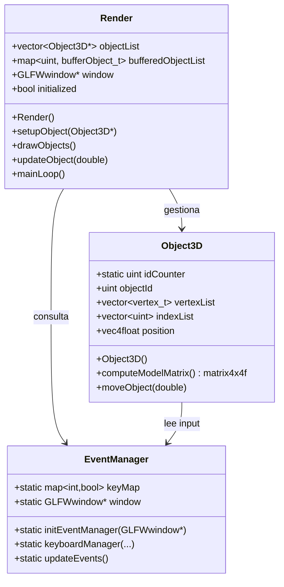

> [!summary]
> Segunda clase práctica. El proyecto evoluciona de un **main monolítico** a una **arquitectura orientada a objetos** con tres sistemas separados: `Render`, `Object3D` y `EventManager`. El `main.cpp` queda reducido a unas pocas líneas.
>
> Conceptos clave:
> - Separación de responsabilidades
> - Clase `Render` como motor gráfico
> - Clase `Object3D` como representación de geometría
> - Gestión de buffers GPU por objeto

---

## Evolución respecto a la primera clase

En la [[Introducción a OpenGL]], todo el código vivía en `main.cpp`: la ventana, el render loop, el input. Ahora separamos responsabilidades:

| Antes (Clase 1) | Ahora (Clase 2) |
|------------------|------------------|
| Todo en `main.cpp` | Dividido en clases |
| Sin objetos 3D | `Object3D` con vértices e índices |
| Sin buffers GPU | VAO/VBO/EBO por objeto |
| Render directo | Clase `Render` gestiona el ciclo |
| Sin delta time | Game loop con delta time |

---

## Archivos del proyecto

| Archivo | Responsabilidad |
|---------|-----------------|
| `main.cpp` | Punto de entrada mínimo |
| `Render.h / .cpp` | Ventana, buffers, ciclo de render |
| `Object3D.h / .cpp` | Datos de geometría y transformaciones |
| `EventManager.h / .cpp` | Sistema de eventos (sin cambios) |
| `common.h` | Headers compartidos |
| `libMath.h` | Vectores, matrices, operaciones matemáticas |

---

## main.cpp — Punto de entrada simplificado

```cpp
#define GLAD_BIN
#include "common.h"
#include "EventManager.h"
#include "Object3D.h"
#include "Render.h"

int main(int argc, char** argv)
{
    auto r = new Render();
    auto obj = new Object3D();
    r->setupObject(obj);
    r->objectList.push_back(obj);
    r->mainLoop();

    glfwTerminate();
    return 0;
}
```

> [!info] ¿Por qué tan corto?
> Toda la lógica se ha movido a las clases. El `main` ahora solo **coordina**: crea el motor, crea un objeto, lo registra y arranca el bucle. Esto es el patrón típico de un motor gráfico simple.

---

### Flujo del programa



---

## Diagrama de clases



---

## Patrón de diseño

> [!important] Separación de responsabilidades
> Cada clase tiene **una sola razón para cambiar**:
> - `Object3D` → cambia si cambia la geometría o el movimiento
> - `Render` → cambia si cambia cómo se dibuja o el ciclo
> - `EventManager` → cambia si cambia el manejo de input
>
> Esto facilita mantener y extender el código.

### ¿Por qué `setupObject` y `objectList` están separados?

```cpp
r->setupObject(obj);          // 1. Sube datos a GPU
r->objectList.push_back(obj); // 2. Registra para dibujar
```

Son dos pasos porque:
1. **`setupObject`** crea los buffers en la GPU (VAO/VBO/EBO) — es una operación costosa que se hace una vez
2. **`push_back`** añade el objeto a la lista de renderizado — determina qué se dibuja cada frame

> [!tip]
> En un motor más completo, podrías tener objetos configurados en GPU pero temporalmente invisibles (desactivados del render sin destruir sus buffers).

---

## Siguientes temas

- [[Object3D]] — Cómo se representan los objetos 3D
- [[Render]] — El sistema de renderizado completo
- [[Buffers (VAO, VBO, EBO)]] — Por qué necesitamos buffers en GPU
- [[Game Loop y Delta Time]] — El bucle principal y tiempo consistente
- [[Movimiento de Objetos]] — Transformaciones y movimiento con input
- [[Cauce Gráfico]] — El pipeline gráfico y sus generaciones
- [[Transformaciones]] — Fundamentos matemáticos de las transformaciones
