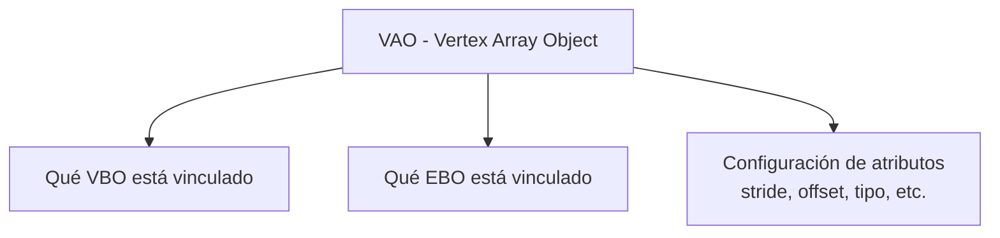
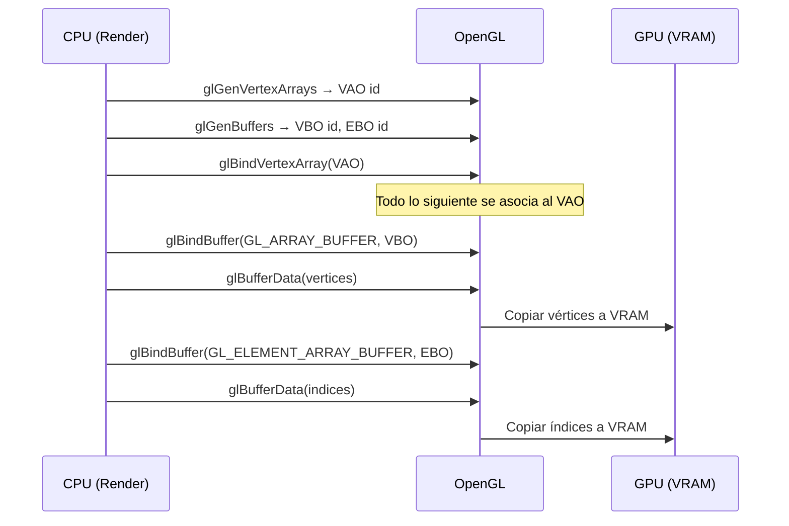
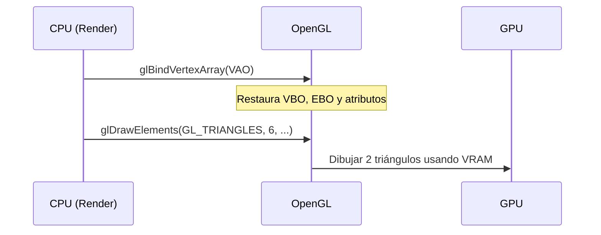

> [!summary]
> Los **buffer objects** son bloques de memoria en la GPU donde almacenamos datos de vértices e índices. Usar buffers es fundamental porque la GPU no puede leer directamente la RAM del CPU; necesita tener los datos en su propia memoria (VRAM).
>
> Conceptos clave:
> - **VBO** (Vertex Buffer Object) — almacena vértices
> - **EBO** (Element Buffer Object) — almacena índices
> - **VAO** (Vertex Array Object) — recuerda la configuración de atributos

---

## ¿Por qué necesitamos buffers?

Sin buffers, cada frame tendríamos que enviar los vértices del CPU a la GPU:

```
CPU (RAM)  ──enviar datos cada frame──→  GPU
           ← MUY LENTO (bus PCIe) ←
```

Con buffers, enviamos los datos **una sola vez** y la GPU los guarda:

```
CPU (RAM)  ──enviar una vez──→  GPU (VRAM)
                                ↓
                          Dibujar desde VRAM
                          ← MUY RÁPIDO ←
```

> [!important] Regla de oro
> **Minimizar las transferencias CPU → GPU.** Cada transferencia es costosa. Por eso usamos `GL_STATIC_DRAW`: subimos una vez, dibujamos muchas.

---

## VBO — Vertex Buffer Object

El VBO almacena los **datos de los vértices** en la GPU.

### Crear y llenar un VBO

```cpp
// 1. Pedir a OpenGL un ID para el buffer
glGenBuffers(1, &bo.vertexBufferId);

// 2. Activar (bind) el buffer como buffer de vértices
glBindBuffer(GL_ARRAY_BUFFER, bo.vertexBufferId);

// 3. Copiar datos de CPU → GPU
glBufferData(GL_ARRAY_BUFFER, 
             obj->vertexList.size() * sizeof(vertex_t),  // tamaño en bytes
             obj->vertexList.data(),                       // puntero a los datos
             GL_STATIC_DRAW);                              // hint de uso
```

> [!info] Analogía
> Piensa en `glGenBuffers` como **reservar una taquilla** en la GPU. `glBindBuffer` es **abrir la taquilla**. `glBufferData` es **meter las cosas dentro**.

### ¿Qué hay dentro del VBO?

Los datos se copian tal cual están en memoria. Nuestro `vector<vertex_t>` se ve así en el VBO:

```
Byte offset:  0                16               32               48
              ┌────────────────┬────────────────┬────────────────┬────────────────┐
Vértice 0:    │  position (4f) │   color (4f)   │
              ├────────────────┼────────────────┤
Vértice 1:    │  position (4f) │   color (4f)   │
              ├────────────────┼────────────────┤
Vértice 2:    │  position (4f) │   color (4f)   │
              ├────────────────┼────────────────┤
Vértice 3:    │  position (4f) │   color (4f)   │
              └────────────────┴────────────────┘
```

Cada `vertex_t` = 32 bytes (4 floats de position × 4 bytes + 4 floats de color × 4 bytes).

---

## EBO — Element Buffer Object

El EBO almacena los **índices** que dicen qué vértices forman cada triángulo.

### Crear y llenar un EBO

```cpp
glGenBuffers(1, &bo.indexBufferId);
glBindBuffer(GL_ELEMENT_ARRAY_BUFFER, bo.indexBufferId);
glBufferData(GL_ELEMENT_ARRAY_BUFFER, 
             sizeof(unsigned int) * obj->indexList.size(),
             obj->indexList.data(), 
             GL_STATIC_DRAW);
```

> [!note] `GL_ARRAY_BUFFER` vs `GL_ELEMENT_ARRAY_BUFFER`
> - `GL_ARRAY_BUFFER` → target para datos de **vértices** (VBO)
> - `GL_ELEMENT_ARRAY_BUFFER` → target para **índices** (EBO)
>
> Es la forma en que OpenGL distingue el tipo de buffer.

### Sin EBO vs Con EBO

**Sin EBO** (usando `glDrawArrays`):
```
Vértices necesarios para un cuadrado (2 triángulos):
v0, v1, v2, v2, v1, v3  →  6 vértices, repitiendo v1 y v2
```

**Con EBO** (usando `glDrawElements`):
```
Vértices: v0, v1, v2, v3  →  solo 4 únicos
Índices:  0, 1, 2, 2, 1, 3  →  6 enteros pequeños (4 bytes c/u)
```

> [!important] ¿Cuándo importa realmente?
> En un cuadrado la diferencia es mínima. Pero en un modelo 3D complejo:
>
> | Modelo | Vértices sin EBO | Vértices con EBO | Índices | Ahorro memoria |
> |--------|-----------------|------------------|---------|----------------|
> | Cubo | 36 | 8 | 36 | ~70% |
> | Esfera (low poly) | ~2400 | ~400 | ~2400 | ~80% |
> | Personaje 3D | ~60000 | ~10000 | ~60000 | ~80% |

---

## VAO — Vertex Array Object

El VAO es un **contenedor** que **recuerda la configuración** de atributos de vértice. Sin VAO, tendríamos que re-configurar todo cada vez que dibujamos.

### ¿Qué "recuerda" el VAO?



### Crear un VAO

```cpp
glGenVertexArrays(1, &bo.bufferId);
glBindVertexArray(bo.bufferId);

// Todo lo que se configure después queda asociado a este VAO:
// - El VBO que se haga bind
// - El EBO que se haga bind
// - Los vertex attributes que se configuren
```

### El poder del VAO al dibujar

**Sin VAO** (hipotético):
```cpp
// Cada frame, para cada objeto:
glBindBuffer(GL_ARRAY_BUFFER, vbo);
glBindBuffer(GL_ELEMENT_ARRAY_BUFFER, ebo);
glVertexPointer(4, GL_FLOAT, 32, (void*)0);
glEnableClientState(GL_VERTEX_ARRAY);
glDrawElements(...);
```

**Con VAO** (lo que realmente hacemos):
```cpp
// Setup (una sola vez):
glBindVertexArray(vao);
// ... configurar VBO, EBO, atributos ...

// Al dibujar (cada frame):
glBindVertexArray(vao);  // ¡Restaura toda la configuración!
glDrawElements(...);     // Listo
```

> [!tip] Analogía
> El VAO es como un **preset de configuración**. En lugar de ajustar 10 parámetros cada vez, guardas el preset una vez y luego solo lo cargas.

---

## Flujo completo: Setup



## Flujo completo: Dibujar



---

## Resumen visual

```
┌─────────────────────────────────────────────────────┐
│                      VAO                             │
│  "Recuerda la configuración"                         │
│                                                      │
│  ┌──────────────┐     ┌──────────────┐              │
│  │     VBO      │     │     EBO      │              │
│  │  (vértices)  │     │  (índices)   │              │
│  │              │     │              │              │
│  │ pos0 | col0  │     │  0, 1, 2     │              │
│  │ pos1 | col1  │     │  2, 1, 3     │              │
│  │ pos2 | col2  │     │              │              │
│  │ pos3 | col3  │     │              │              │
│  └──────────────┘     └──────────────┘              │
│                                                      │
│  Atributos:                                          │
│  • position: 4 floats, stride=32, offset=0          │
│  • color:    4 floats, stride=32, offset=16         │
└─────────────────────────────────────────────────────┘
```

---

## Relación con el código del proyecto

| Nuestro código | Qué buffer |
|----------------|-----------|
| `bo.bufferId` | VAO |
| `bo.vertexBufferId` | VBO |
| `bo.indexBufferId` | EBO |
| `bufferedObjectList[objectId]` | Mapa para encontrar los buffers de cada objeto |

---

## Véase también

- [[Render]] — Donde se crean y usan estos buffers
- [[Object3D]] — Los datos que se suben a los buffers
- [[Learn OpenGL/3. Hello Triangle/Vertex Input|Vertex Input]]
- [[Learn OpenGL/3. Hello Triangle/Vertex Array Object|Vertex Array Object]]
- [[Learn OpenGL/3. Hello Triangle/Element Buffer Objects|Element Buffer Objects]]
- [[Learn OpenGL/3. Hello Triangle/Linking Vertex Attributes|Linking Vertex Attributes]]
