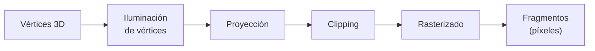
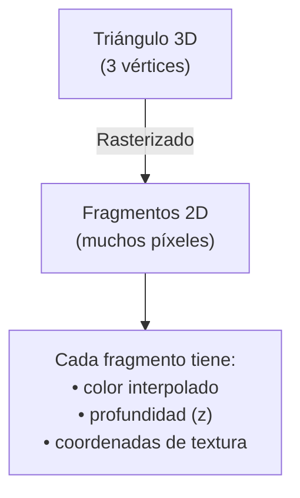
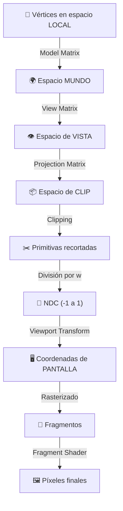

> [!summary]
> El **cauce gráfico** (graphics pipeline) es la secuencia de etapas que transforman datos 3D en píxeles en pantalla. Ha evolucionado desde pipelines fijos hasta cauces completamente programables con shaders, permitiendo técnicas avanzadas como iluminación global y ray tracing en tiempo real.
>
> Conceptos clave:
> - Generaciones de GPUs (4ª y 5ª generación)
> - Etapas del cauce: iluminación de vértices → proyección → clipping → rasterizado
> - Pipeline fijo vs programable
> - De 3D a píxeles

---

## Evolución del cauce gráfico

### Cuarta generación — Cauce programable

La **cuarta generación** de GPUs introduce el **cauce gráfico programable**: las fases de operaciones sobre vértices y rasterización de polígonos se reparten en varios procesadores.

Cada procesador puede ejecutar el programa "estándar", o **se puede reescribir** para generar mejores efectos gráficos. Esto es lo que conocemos como **shaders**.

> [!info] Pipeline fijo vs programable
> En el pipeline fijo, las operaciones están preestablecidas y no se pueden modificar. En el programable, el desarrollador escribe código (shaders) que se ejecuta directamente en la GPU.
> Ver más: [[Learn OpenGL/1. Theory/Core Profile vs Immediate Mode|Core Profile vs Immediate Mode]]

### Quinta generación — Iluminación global

La **quinta generación** (y siguientes) permite implementar técnicas de **iluminación global** directamente en la GPU, que antes solo se aplicaban por software:

| Técnica | Descripción |
|---------|-------------|
| **Photon Mapping** | Simula cómo los fotones rebotan en la escena |
| **Ray Tracing** | Traza rayos desde la cámara para calcular intersecciones y color |
| **Path Tracing** | Extensión del ray tracing con múltiples rebotes de luz |

> [!note]
> Estas técnicas antes requerían minutos u horas de cómputo en CPU. Las GPUs modernas permiten ejecutarlas en **tiempo real**.
> Ver más: [[Computer Graphics/1. Introduction/Hardware and Software|Hardware and Software]]

---

## Etapas del cauce gráfico

El cauce gráfico transforma los datos 3D en píxeles 2D a través de varias fases encadenadas:



> [!tip] Pipeline completo en OpenGL moderno
> El pipeline completo incluye además vertex shader, geometry shader, fragment shader, y tests de profundidad/stencil.
> Ver: [[Learn OpenGL/3. Hello Triangle/Basic Theory|Basic Theory (Hello Triangle)]]

---

### 1. Iluminación de vértices

Se realizan operaciones sobre los **vértices** para iluminarlos de acuerdo con los focos de iluminación distribuidos en la escena.

- La iluminación de los elementos **entre los vértices** se realiza mediante **interpolación** de los valores.
- En GPUs de cuarta o quinta generación, se pueden realizar operaciones más avanzadas en etapas posteriores (por ejemplo, iluminación **por píxel** en el fragment shader).

```
Vértice A (brillante)          Vértice B (oscuro)
     ●━━━━━━━━━━━━━━━━━━━━━━●
     ↑                        ↑
  Color calculado          Color calculado
  con las luces            con las luces
     
  Los píxeles intermedios se INTERPOLAN:
     ●━━━●━━━●━━━●━━━●━━━●━━━●
   100%  83%  67%  50%  33%  17%   0%
```

> [!info] Interpolación
> La interpolación entre vértices es lo que permite tener transiciones suaves de color e iluminación sin calcular la luz en cada píxel individualmente (en el pipeline clásico).
> Ver más: [[Learn OpenGL/3. Hello Triangle/Fragment Shader|Fragment Shader]] — El fragment shader moderno permite iluminación por fragmento
> Ver también: [[Computer Graphics/1. Introduction/Elements of 3D Graphics|Elements of 3D Graphics]]

---

### 2. Proyección

La escena se transforma a un espacio de coordenadas llamado **"espacio homogéneo de clipping"** (clip space), que es el idóneo para la siguiente fase de recorte.

Existen dos tipos principales de proyección:

| Tipo | Descripción | Uso típico |
|------|-------------|-----------|
| **Ortográfica** | Los objetos se ven del mismo tamaño independientemente de la distancia a la cámara | CAD, vistas técnicas, juegos 2D |
| **Perspectiva** | Los objetos más lejanos se ven más pequeños (como en la vida real) | Juegos 3D, simulaciones |

```
Proyección ortográfica:          Proyección perspectiva:
┌───────────┐ → ┌───────────┐   ╲─────────╱ → ┌───────────┐
│  ■        │   │  ■        │    ╲  ■    ╱    │  ■        │
│      □    │   │      □    │     ╲  □  ╱     │    □      │  ← más pequeño
│           │   │           │      ╲   ╱      │           │    (más lejos)
└───────────┘   └───────────┘       ╲ ╱       └───────────┘
 Mismo tamaño                    Se reduce con distancia
```

> [!important] Espacio de clipping
> La proyección transforma las coordenadas al rango $[-w, w]$ en cada eje. Tras la **división por perspectiva** ($x/w$, $y/w$, $z/w$), se obtienen las Coordenadas Normalizadas del Dispositivo (NDC) en el rango $[-1, 1]$.
> Ver más: [[Learn OpenGL/7. Coordinate Systems/Clip space|Clip space]]
> Ver también: [[Learn OpenGL/7. Coordinate Systems/Orthographic projection|Orthographic projection]]
> Ver también: [[Learn OpenGL/7. Coordinate Systems/Perspective projection|Perspective projection]]
> Ver también: [[Computer Graphics/3. OpenGL Geometry/3.3 Projection and Viewing/Projection Transformation|Projection Transformation]]

---

### 3. Clipping

En esta fase, se **recorta** la escena para que solo queden los objetos que se verán desde el punto de vista de la cámara, dependiendo de su ángulo de visión.

```
                    Frustum de la cámara
                   ╱─────────────────╲
                  ╱   ■  ●           ╲
                 ╱       ▲            ╲
                ╱─────────────────────╲
                         
  ◆ (fuera)                            ★ (fuera)
  → DESCARTADO                         → DESCARTADO
```

> [!note] Optimización
> Esta fase **no es estrictamente necesaria** para obtener un resultado correcto, pero es fundamental para acelerar las siguientes fases. Cuantas menos primitivas haya que procesar, más rápido se renderizará la escena.

> [!tip] Frustum culling
> El volumen visible se llama **frustum** (tronco de pirámide en perspectiva, o caja en ortográfica). Todo lo que queda fuera se descarta antes de rasterizar.
> Ver más: [[Computer Graphics/3. OpenGL Geometry/3.3 Projection and Viewing/Many Coordinate Systems|Many Coordinate Systems]]

---

### 4. Rasterizado

En este punto se transforman las primitivas 3D en **"fragmentos"** o primitivas gráficas 2D.

Desde aquí, se usa un cauce gráfico basado en **píxeles**, donde cada píxel conserva sus atributos:
- **Colores** (interpolados de los vértices)
- **Valores de iluminación**
- **Coordenadas de texturas** para la siguiente fase



> [!info] Fragmento vs píxel
> Un **fragmento** no es exactamente un píxel. Un fragmento es un candidato a píxel que aún debe pasar por tests adicionales (profundidad, stencil, alpha) antes de escribirse en pantalla. Varios fragmentos pueden competir por el mismo píxel.
> Ver más: [[Learn OpenGL/3. Hello Triangle/Fragment Shader|Fragment Shader]]

---

## Pipeline completo — De vértices a pantalla

Combinando todas las etapas con los espacios de coordenadas:



> [!important] La cadena de transformación
> $$V_{clip} = M_{projection} \times M_{view} \times M_{model} \times V_{local}$$
>
> Cada matriz transforma de un espacio al siguiente. Esta cadena es el corazón de todo el rendering 3D.
> Ver: [[Learn OpenGL/7. Coordinate Systems/The global picture|The global picture]]
> Ver: [[Learn OpenGL/7. Coordinate Systems/Basic Theory|Basic Theory (Coordinate Systems)]]
> Ver: [[Computer Graphics/3. OpenGL Geometry/3.3 Projection and Viewing/Many Coordinate Systems|Many Coordinate Systems]]

---

## Véase también

- [[Render]] — Implementación del rendering en nuestro motor
- [[Transformaciones]] — Matrices y coordenadas homogéneas
- [[Buffers (VAO, VBO, EBO)]] — Datos que entran al pipeline
- [[Learn OpenGL/3. Hello Triangle/Basic Theory|Basic Theory (Hello Triangle)]] — Pipeline en OpenGL moderno
- [[Learn OpenGL/3. Hello Triangle/Vertex Shader|Vertex Shader]]
- [[Learn OpenGL/3. Hello Triangle/Fragment Shader|Fragment Shader]]
- [[Computer Graphics/1. Introduction/Elements of 3D Graphics|Elements of 3D Graphics]]
- [[Computer Graphics/1. Introduction/Hardware and Software|Hardware and Software]]

