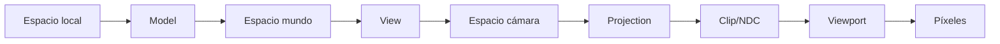

> [!summary]
> La representación en pantalla de modelos 3D se apoya en dos transformaciones clave: **vista** (cámara) y **proyección**. La primera lleva coordenadas de mundo al sistema del observador; la segunda mapea ese volumen al espacio visible 2D.

# Cámara y proyección

---

## Matrices fundamentales

1. **Matriz de vista** (camera/view)
2. **Matriz de proyección** (ortográfica o perspectiva)

Cadena típica:

$$V_{clip} = M_{projection} \times M_{view} \times M_{model} \times V_{local}$$

Ver contexto en [[Cauce Gráfico]] y [[Transformaciones]].

---

## 1) Cámara (View Matrix)

La cámara define el observador con:
- posición,
- orientación,
- punto objetivo.

Base ortonormal:

- $forward = normalize(target - position)$
- $right = normalize(cross(forward, orientation))$
- $up = cross(right, forward)$

Traslación en espacio de vista:

$$positionView = (-dot(right,pos), -dot(up,pos), dot(forward,pos))$$

Forma clásica de $M_{view}$:

$$
M_{view} = \begin{pmatrix}
right_x & right_y & right_z & position_x \\
up_x & up_y & up_z & position_y \\
-forward_x & -forward_y & -forward_z & position_z \\
0 & 0 & 0 & 1
\end{pmatrix}
$$

---

## 2) Proyección

Por defecto, tras normalización se trabaja en NDC, con coordenadas en $[-1,1]$.

### Ortográfica
- Líneas de proyección paralelas.
- Tamaño aparente no depende de distancia.
- Útil en CAD/UI técnica.

### Perspectiva
- Líneas convergen al punto de fuga.
- Objetos lejanos se ven más pequeños.
- Realismo visual para escenas 3D.

> [!info]
> En perspectiva, las coordenadas $x,y$ quedan condicionadas por profundidad ($z$), de ahí el efecto de fuga.

---

## Matriz de perspectiva (forma estándar)

Con parámetros `fovy`, `aspect`, `zNear`, `zFar`:

$$
M_{persp} = \begin{pmatrix}
\frac{1}{aspect\tan(fovy/2)} & 0 & 0 & 0 \\
0 & \frac{1}{\tan(fovy/2)} & 0 & 0 \\
0 & 0 & -\frac{zFar+zNear}{zFar-zNear} & -\frac{2zFar\,zNear}{zFar-zNear} \\
0 & 0 & -1 & 0
\end{pmatrix}
$$

---

## Ejemplo funcional (GLM + OpenGL)

```cpp
#include <glm/glm.hpp>
#include <glm/gtc/matrix_transform.hpp>
#include <glm/gtc/type_ptr.hpp>

// Datos de cámara
glm::vec3 cameraPos   = glm::vec3(0.0f, 0.0f, 3.0f);
glm::vec3 cameraFront = glm::vec3(0.0f, 0.0f, -1.0f);
glm::vec3 cameraUp    = glm::vec3(0.0f, 1.0f,  0.0f);

// 1) View matrix
glm::mat4 view = glm::lookAt(cameraPos, cameraPos + cameraFront, cameraUp);

// 2) Projection matrix
float fov = glm::radians(45.0f);
float aspect = 800.0f / 600.0f;
float zNear = 0.1f;
float zFar  = 100.0f;
glm::mat4 projection = glm::perspective(fov, aspect, zNear, zFar);

// 3) Enviar uniforms al shader
unsigned int viewLoc = glGetUniformLocation(shaderProgram, "view");
unsigned int projLoc = glGetUniformLocation(shaderProgram, "projection");
glUniformMatrix4fv(viewLoc, 1, GL_FALSE, glm::value_ptr(view));
glUniformMatrix4fv(projLoc, 1, GL_FALSE, glm::value_ptr(projection));
```

> [!tip]
> Este bloque es directamente usable en un render loop moderno con shaders. Si tu cámara se mueve, recalcula `view` cada frame; `projection` solo cuando cambie FOV o aspect ratio.

### Vertex shader mínimo para ese ejemplo

```glsl
#version 330 core
layout (location = 0) in vec3 aPos;

uniform mat4 model;
uniform mat4 view;
uniform mat4 projection;

void main()
{
    gl_Position = projection * view * model * vec4(aPos, 1.0);
}
```

> [!important]
> Orden correcto: `projection * view * model * vec4(...)`. Cambiar el orden produce transformaciones incorrectas.

---

## Secuencia conceptual de transformación



---

## Errores comunes

- Invertir orden de multiplicación de matrices.
- Usar `zNear` demasiado pequeño (inestabilidad de profundidad).
- Confundir coordenadas mundo con cámara.
- No normalizar base `right/up/forward`.

> [!warning]
> Un mal ajuste de `zNear` y `zFar` reduce precisión del z-buffer y causa z-fighting.

---

## Conexiones con el temario

- [[Técnicas de Representación]]
- [[Representación de Fronteras (B-Rep)]]
- [[Transformaciones]]
- [[Cauce Gráfico]]
- [[Learn OpenGL/7. Coordinate Systems/Clip space|Clip space]]
- [[Learn OpenGL/7. Coordinate Systems/Perspective projection|Perspective projection]]

