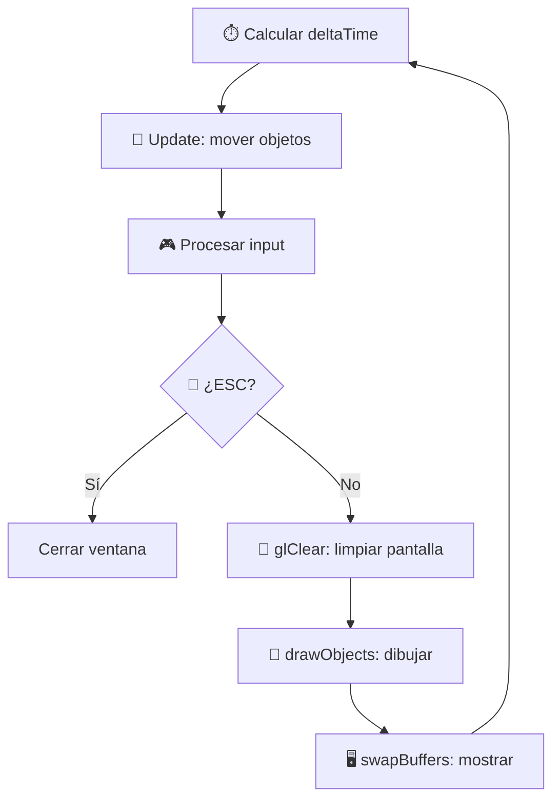

> [!summary]
> El **game loop** es el bucle principal que ejecuta cada frame de la aplicación: calcula el **delta time**, actualiza la lógica, procesa eventos, renderiza y muestra el resultado. El delta time garantiza que el movimiento sea **consistente** independientemente de los FPS.
>
> Conceptos clave:
> - Estructura del game loop
> - Delta time y por qué es necesario
> - Orden de operaciones en cada frame
> - Double buffering

---

## Estructura del Game Loop

```cpp
void Render::mainLoop() {
    if (!initialized || window == nullptr) {
        return;
    }
    
    double lastTime = 0;
    double newTime = glfwGetTime();
    double deltaTime = newTime - lastTime;

    while (!glfwWindowShouldClose(window))
    {
        // 1. Calcular delta time
        newTime = glfwGetTime();
        deltaTime = newTime - lastTime;
        lastTime = newTime;

        // 2. Actualizar lógica (movimiento)
        updateObject(deltaTime);
        
        // 3. Procesar eventos de input
        EventManager::updateEvents();

        // 4. Comprobar cierre
        if (EventManager::keyMap[GLFW_KEY_ESCAPE]) {
            glfwSetWindowShouldClose(window, true);
        }

        // 5. Renderizar
        glClear(GL_COLOR_BUFFER_BIT);
        drawObjects();

        // 6. Mostrar frame
        glfwSwapBuffers(window);
    }
}
```

---

## ¿Qué es el Delta Time?

El **delta time** ($\Delta t$) es el tiempo transcurrido entre el frame actual y el anterior.

```cpp
newTime = glfwGetTime();        // Tiempo actual (en segundos desde inicio)
deltaTime = newTime - lastTime; // Diferencia con el frame anterior
lastTime = newTime;             // Guardar para el próximo frame
```

### ¿Por qué es necesario?

**Sin delta time** — movimiento dependiente de FPS:
```cpp
position.y += speed;  // ¡Se mueve más rápido a más FPS!
```

| FPS | Movimiento por segundo |
|-----|----------------------|
| 30 | 30 × speed |
| 60 | 60 × speed |
| 144 | 144 × speed |

**Con delta time** — movimiento consistente:
```cpp
position.y += speed * deltaTime;  // Siempre la misma velocidad real
```

| FPS | $\Delta t$ (aprox) | Movimiento por frame | Total por segundo |
|-----|---------------------|---------------------|-------------------|
| 30 | 0.033s | speed × 0.033 | speed × 1.0 |
| 60 | 0.017s | speed × 0.017 | speed × 1.0 |
| 144 | 0.007s | speed × 0.007 | speed × 1.0 |

> [!important] La fórmula fundamental
> $$\text{nueva\_posición} = \text{posición} + \text{velocidad} \times \Delta t$$
>
> Esto viene directamente de la física: $x = x_0 + v \cdot t$
>
> El delta time convierte "unidades por frame" en "unidades por segundo", haciendo el movimiento **independiente del framerate**.

---

## Orden de operaciones en cada frame



> [!note] ¿Por qué este orden?
> 1. **Delta time primero** — necesitamos saber cuánto tiempo pasó
> 2. **Update antes de input** — movemos con el deltaTime calculado
> 3. **Input antes de render** — procesamos teclas para el próximo frame
> 4. **Clear → Draw → Swap** — el orden estándar de rendering

---

## Double Buffering

```cpp
glfwSwapBuffers(window);
```

OpenGL usa **dos buffers** de imagen:

| Buffer | Descripción |
|--------|-------------|
| **Front buffer** | Lo que se muestra en pantalla ahora |
| **Back buffer** | Donde se está dibujando el siguiente frame |

```
Frame N:                          Frame N+1:
┌──────────┐  ┌──────────┐      ┌──────────┐  ┌──────────┐
│  FRONT   │  │  BACK    │      │  FRONT   │  │  BACK    │
│(mostrando)│  │(dibujando)│  →  │(era back)│  │(era front)│
└──────────┘  └──────────┘      └──────────┘  └──────────┘
                    swap!
```

> [!info] ¿Por qué no dibujar directamente en pantalla?
> Si dibujáramos directamente, el usuario vería el proceso de dibujo parcial (flickering/parpadeo). Con double buffering, solo se muestra el frame **completo**.
> Ver más: [[Learn OpenGL/2. Create a Window/Render Loop|Render Loop]]

---

## Guard clause de seguridad

```cpp
if (!initialized || window == nullptr) {
    return;
}
```

> [!warning] Protección contra uso incorrecto
> Si el constructor del `Render` falló (GLFW no se inicializó, no se creó la ventana, GLAD falló), `initialized` será `false` y el loop no se ejecuta. Esto evita crashes por acceder a punteros nulos.

---

## Valores típicos de Delta Time

| Situación | FPS | Delta Time |
|-----------|-----|-----------|
| Juego fluido | 60 | ~16.67 ms |
| Monitor gaming | 144 | ~6.94 ms |
| Bajón de rendimiento | 15 | ~66.67 ms |
| Primer frame | — | Puede ser muy grande |

> [!tip] Cuidado con el primer frame
> En el código, `lastTime` empieza en `0`. Si `glfwGetTime()` devuelve, por ejemplo, `0.5` segundos, el primer `deltaTime` será `0.5` — mucho más grande de lo normal. En motores profesionales se suele **clampear** el delta time:
> ```cpp
> deltaTime = min(deltaTime, 0.1);  // Máximo 100ms por frame
> ```

---

## Véase también

- [[Render]] — El mainLoop completo
- [[Movimiento de Objetos]] — Cómo se usa el delta time para mover
- [[Arquitectura del Motor]] — Visión general
- [[Cauce Gráfico]] — El pipeline que se ejecuta cada frame
- [[Learn OpenGL/2. Create a Window/Render Loop|Render Loop]]

