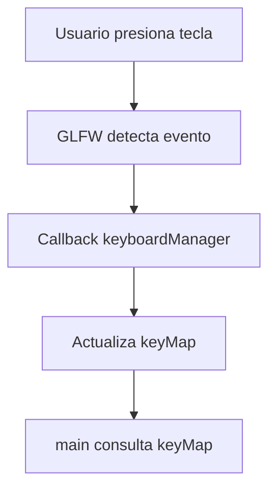

> [!summary]
> Primera clase práctica de OpenGL. Se crea una **ventana básica** con GLFW, se inicializa GLAD, y se implementa un **sistema de gestión de eventos** mediante callbacks para manejar el teclado.
>
> Conceptos clave:
> - Inicialización de GLFW y GLAD
> - Creación de ventana y contexto OpenGL
> - Render loop básico
> - Sistema de eventos con callbacks

---

## Archivos del proyecto

El proyecto se divide en **cuatro archivos principales**:

| Archivo | Descripción |
|---------|-------------|
| `main.cpp` | Punto de entrada, inicialización y render loop |
| `EventManager.h` | Header de la clase gestora de eventos |
| `EventManager.cpp` | Implementación del gestor de eventos |
| `common.h` | Header común del proyecto (proporcionado por el profesor) |

---

## main.cpp — Punto de entrada

```cpp
#define GLAD_BIN
#include "common.h"
#include "EventManager.h"

int main(int argc, char** argv)
{
    // Inicializar GLFW
    if (!glfwInit())
    {
        std::cerr << "ERROR: Failed to initialize glfw" << std::endl;
        return -1;
    }
    glfwWindowHint(GLFW_CONTEXT_VERSION_MAJOR, 3);
    glfwWindowHint(GLFW_CONTEXT_VERSION_MINOR, 3);
    glfwWindowHint(GLFW_OPENGL_PROFILE, GLFW_OPENGL_COMPAT_PROFILE);
    glfwWindowHint(GLFW_RESIZABLE, GL_FALSE);

    GLFWwindow* window = glfwCreateWindow(800, 600, "Hello Triangle", nullptr, nullptr);
    if (!window)
    {
        std::cerr << "ERROR: Failed to create window" << std::endl;
        glfwTerminate();
        return -1;
    }
    glfwMakeContextCurrent(window);

    if (!gladLoadGL(glfwGetProcAddress))
    {
        std::cerr << "ERROR: Failed to initialize GLAD" << std::endl;
        glfwTerminate();
        return -1;
    }

    EventManager::initEventManager(window);
    while (!glfwWindowShouldClose(window))
    {
        // Procesar eventos del sistema y callbacks registrados
        EventManager::updateEvents();

        // Cerrar la ventana si se pulsa ESC
        if (EventManager::keyMap.count(GLFW_KEY_ESCAPE) && EventManager::keyMap[GLFW_KEY_ESCAPE]) {
            glfwSetWindowShouldClose(window, true);
        }

        // Render sencillo: limpiar pantalla
        glClearColor(0.1f, 0.1f, 0.1f, 1.0f);
        glClear(GL_COLOR_BUFFER_BIT);

        // Intercambiar buffers
        glfwSwapBuffers(window);
    }
    glfwTerminate();
    return 0;
}
```

---

### Desglose del código

#### 1. Inicialización de GLFW

```cpp
if (!glfwInit()) {
    std::cerr << "ERROR: Failed to initialize glfw" << std::endl;
    return -1;
}
glfwWindowHint(GLFW_CONTEXT_VERSION_MAJOR, 3);
glfwWindowHint(GLFW_CONTEXT_VERSION_MINOR, 3);
glfwWindowHint(GLFW_OPENGL_PROFILE, GLFW_OPENGL_COMPAT_PROFILE);
glfwWindowHint(GLFW_RESIZABLE, GL_FALSE);
```

> [!info]
> `glfwInit()` inicializa la librería GLFW. Debe llamarse **antes de cualquier otra función GLFW**.
> Ver más en: [[Learn OpenGL/2. Create a Window/Start|Start]]

### Window Hints - Configuración de OpenGL

Antes de crear la ventana, usamos `glfwWindowHint` para configurar parámetros:

| Hint | Valor | Descripción |
|------|-------|-------------|
| `GLFW_CONTEXT_VERSION_MAJOR` | `3` | Versión mayor de OpenGL (3.x) |
| `GLFW_CONTEXT_VERSION_MINOR` | `3` | Versión menor de OpenGL (x.3) |
| `GLFW_OPENGL_PROFILE` | `GLFW_OPENGL_COMPAT_PROFILE` | Perfil de compatibilidad |
| `GLFW_RESIZABLE` | `GL_FALSE` | Ventana no redimensionable |

> [!important] OpenGL 3.3 Compatibility Profile
> Pedimos **OpenGL 3.3** en **compatibility profile**. Esto permite:
> - Usar funciones **modernas** (VAO, VBO, shaders)
> - Usar funciones **legacy** (`glBegin/glEnd`, `glPushMatrix`, client state arrays)
>
> Si pidiéramos **core profile**, las funciones legacy estarían **prohibidas**.
> Ver más: [[Learn OpenGL/1. Theory/Core Profile vs Immediate Mode|Core Profile vs Immediate Mode]]

El hint `GLFW_RESIZABLE` desactiva el redimensionado de la ventana.

---

#### 2. Creación de la ventana

```cpp
GLFWwindow* window = glfwCreateWindow(800, 600, "Hello Triangle", nullptr, nullptr);
if (!window) {
    std::cerr << "ERROR: Failed to create window" << std::endl;
    glfwTerminate();
    return -1;
}
glfwMakeContextCurrent(window);
```

| Parámetro | Descripción |
|-----------|-------------|
| `800, 600` | Ancho y alto en píxeles |
| `"Hello Triangle"` | Título de la ventana |
| `nullptr, nullptr` | Monitor (fullscreen) y ventana compartida |

> [!important]
> `glfwMakeContextCurrent(window)` establece el contexto OpenGL de esta ventana como activo. **Obligatorio antes de usar GLAD**.
> Ver más en: [[Learn OpenGL/2. Create a Window/Start|Start]]

---

#### 3. Inicialización de GLAD

```cpp
if (!gladLoadGL(glfwGetProcAddress)) {
    std::cerr << "ERROR: Failed to initialize GLAD" << std::endl;
    glfwTerminate();
    return -1;
}
```

> [!note]
> A diferencia del tutorial de LearnOpenGL que usa `gladLoadGLLoader((GLADloadproc)glfwGetProcAddress)`, aquí usamos la versión simplificada `gladLoadGL(glfwGetProcAddress)` que viene con GLAD2.
> Ver más en: [[Learn OpenGL/2. Create a Window/GLAD|GLAD]]

---

#### 4. Render Loop

```cpp
while (!glfwWindowShouldClose(window))
{
    EventManager::updateEvents();
    
    if (EventManager::keyMap.count(GLFW_KEY_ESCAPE) && EventManager::keyMap[GLFW_KEY_ESCAPE]) {
        glfwSetWindowShouldClose(window, true);
    }

    glClearColor(0.1f, 0.1f, 0.1f, 1.0f);
    glClear(GL_COLOR_BUFFER_BIT);

    glfwSwapBuffers(window);
}
```

> [!info]
> El render loop es el corazón de la aplicación. Cada iteración = un **frame**.
> Ver más en: [[Learn OpenGL/2. Create a Window/Render Loop|Render Loop]]

| Función | Descripción |
|---------|-------------|
| `glClearColor(r,g,b,a)` | Define el color de limpieza (gris oscuro `0.1, 0.1, 0.1`) |
| `glClear(GL_COLOR_BUFFER_BIT)` | Limpia el buffer de color |
| `glfwSwapBuffers(window)` | Intercambia front/back buffers (double buffering) |

Ver más sobre rendering en: [[Learn OpenGL/2. Create a Window/Rendering|Rendering]]

---

#### 5. Limpieza

```cpp
glfwTerminate();
return 0;
```

> [!tip]
> Siempre llamar a `glfwTerminate()` al salir para liberar recursos correctamente.
> Ver más en: [[Learn OpenGL/2. Create a Window/Terminate|Terminate]]

---

## EventManager — Sistema de gestión de eventos

### EventManager.h

```cpp
#pragma once

#include <map>

struct GLFWwindow; // forward declaration

class EventManager {
public:
    static std::map<int,bool> keyMap;
    static GLFWwindow* window;
    static void initEventManager(GLFWwindow* window);
    static void keyboardManager(GLFWwindow* window, int key, int scancode, int action, int mods);
    static void updateEvents();
};
```

> [!note]
> **Forward declaration**: Declaramos `GLFWwindow` sin incluir el header completo para evitar dependencias innecesarias y problemas con GLAD.

---

### EventManager.cpp

```cpp
#include "EventManager.h"
#include <GLFW/glfw3.h>

GLFWwindow* EventManager::window = nullptr;
std::map<int,bool> EventManager::keyMap;

void EventManager::initEventManager(GLFWwindow* win) {
    glfwSetKeyCallback(win, keyboardManager);
    EventManager::window = win;
}

void EventManager::keyboardManager(GLFWwindow* win, int key, int scancode, int action, int mods) {
    switch (action) {
        case GLFW_PRESS:
            EventManager::keyMap[key] = true;
            break;
        case GLFW_RELEASE:
            EventManager::keyMap[key] = false;
            break;
        default:
            break;
    }
}

void EventManager::updateEvents() {
    glfwPollEvents();
}
```

---

### Explicación del EventManager

#### Sistema de Callbacks

```cpp
glfwSetKeyCallback(win, keyboardManager);
```

GLFW usa **callbacks** para manejar eventos. Registramos `keyboardManager` como el callback de teclado.

> [!important]
> A diferencia del método `glfwGetKey()` que consulta el estado en cada frame (polling), los **callbacks** se ejecutan automáticamente cuando ocurre un evento.
> Ver comparación en: [[Learn OpenGL/2. Create a Window/Input|Input]]

---

#### Mapa de teclas

```cpp
static std::map<int,bool> keyMap;
```

| Ventaja | Descripción |
|---------|-------------|
| **Persistencia** | Guarda el estado de cada tecla entre frames |
| **Flexibilidad** | Permite consultar cualquier tecla desde cualquier parte del código |
| **Escalabilidad** | Fácil añadir más teclas sin modificar el callback |

---

#### Flujo de eventos



---

## Diferencias con LearnOpenGL

| Aspecto | LearnOpenGL | Clase |
|---------|-------------|-------|
| Manejo de input | `glfwGetKey()` (polling) | Callbacks + `keyMap` |
| GLAD | `gladLoadGLLoader()` | `gladLoadGL()` (GLAD2) |
| Estructura | Todo en `main.cpp` | Separado en clases |
| Headers | Includes directos | `common.h` centralizado |

---

## Notas adicionales

> [!warning]
> El header `common.h` proporcionado por el profesor incluye las dependencias necesarias (GLAD, GLFW, iostream, etc.). **No incluir GLAD directamente** en otros archivos para evitar redefiniciones.

> [!tip]
> El `#define GLAD_BIN` al inicio indica que la implementación de GLAD se incluye en este archivo. Solo debe aparecer en **una unidad de traducción**. 

---

## Siguiente clase

En la segunda clase, este código evoluciona a una **arquitectura orientada a objetos** con clases separadas para renderizado y geometría:

- [[Arquitectura del Motor]] — Cómo se reorganiza el proyecto
- [[Object3D]] — Representación de objetos 3D
- [[Render]] — Sistema de renderizado con buffers GPU
- [[Buffers (VAO, VBO, EBO)]] — Memoria en la GPU
- [[Game Loop y Delta Time]] — Bucle principal con tiempo consistente
- [[Movimiento de Objetos]] — Transformaciones con input
- [[Cauce Gráfico]] — El pipeline gráfico completo
- [[Transformaciones]] — Matrices y coordenadas homogéneas


