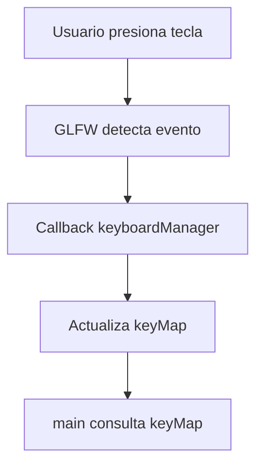
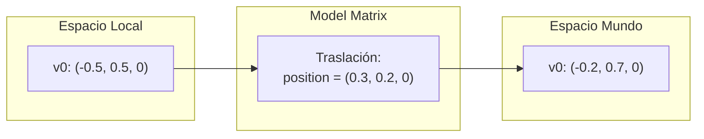
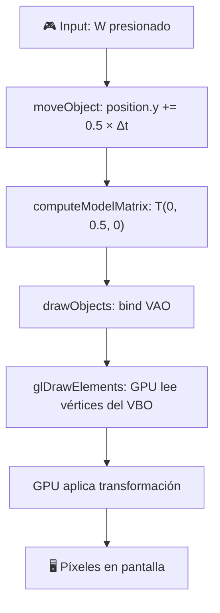

> [!summary]
> El movimiento de objetos se implementa modificando la **posición** del objeto en función del **input del usuario** y el **delta time**. La posición se traduce a una **model matrix** que transforma los vértices de espacio local a espacio mundo cada frame.
>
> Conceptos clave:
> - Movimiento basado en input y delta time
> - Model matrix como traslación
> - Por qué no modificamos los vértices directamente
> - Cadena de transformación

---

## moveObject — Movimiento con input

```cpp
void Object3D::moveObject(double deltaTime) {
    float speed = 0.5f;
    if (EventManager::keyMap[GLFW_KEY_W]) {
        position.y += speed * deltaTime;
    }
    if (EventManager::keyMap[GLFW_KEY_S]) {
        position.y -= speed * deltaTime;
    }
}
```

### Desglose

| Elemento | Valor | Descripción |
|----------|-------|-------------|
| `speed` | `0.5f` | 0.5 unidades por segundo |
| `deltaTime` | ~0.016s a 60 FPS | Tiempo del frame |
| `speed * deltaTime` | ~0.008 | Movimiento por frame |
| `GLFW_KEY_W` | Arriba | Aumenta Y (sube) |
| `GLFW_KEY_S` | Abajo | Disminuye Y (baja) |

> [!info] La fórmula
> $$\text{position.y} = \text{position.y} + \text{speed} \times \Delta t$$
>
> A `speed = 0.5`, el objeto tarda **2 segundos** en recorrer 1 unidad (la mitad de la pantalla, ya que va de -1 a 1).
> Ver por qué necesitamos delta time en: [[Game Loop y Delta Time]]

### Flujo del input



> [!note] Consulta vs callback
> `moveObject` **consulta** el mapa de teclas (`keyMap[GLFW_KEY_W]`), no recibe eventos directamente. Esto desacopla el movimiento del sistema de eventos.
> Ver sistema de eventos en: [[Introducción a OpenGL#EventManager — Sistema de gestión de eventos]]

---

## ¿Por qué no mover los vértices directamente?

Podríamos hacer:
```cpp
// ❌ Mala idea: mover cada vértice individualmente
for (auto& v : vertexList) {
    v.position.y += speed * deltaTime;
}
```

Pero esto tiene problemas:

| Problema | Explicación |
|----------|-------------|
| **Rendimiento** | Hay que re-subir los vértices a la GPU cada frame (`glBufferData` de nuevo) |
| **Precisión** | Errores de punto flotante se acumulan con cada suma |
| **Flexibilidad** | Difícil combinar traslación + rotación + escala |
| **Datos originales** | Pierdes la geometría original del objeto |

> [!important] La solución: Model Matrix
> En lugar de mover los vértices, guardamos una **posición** y generamos una **matriz de transformación**. Los vértices originales nunca cambian; la GPU aplica la matriz al dibujar.

---

## computeModelMatrix — De local a mundo

```cpp
matrix4x4f Object3D::computeModelMatrix() {
    matrix4x4f model = make_translate(position.x, position.y, position.z);
    return model;
}
```

### ¿Qué hace la model matrix?

Transforma las coordenadas **locales** del objeto (las que definimos en el constructor) a coordenadas del **mundo** (donde realmente está el objeto).



### La matriz de traslación

`make_translate(tx, ty, tz)` genera:

$$
M = \begin{pmatrix} 1 & 0 & 0 & t_x \\ 0 & 1 & 0 & t_y \\ 0 & 0 & 1 & t_z \\ 0 & 0 & 0 & 1 \end{pmatrix}
$$

Al multiplicar por un vértice:

$$
M \cdot \begin{pmatrix} x \\ y \\ z \\ 1 \end{pmatrix} = \begin{pmatrix} x + t_x \\ y + t_y \\ z + t_z \\ 1 \end{pmatrix}
$$

> [!info] Coordenadas homogéneas
> El `1` en la cuarta componente (`w = 1`) es lo que permite que la traslación funcione. Si `w = 0`, la traslación no tiene efecto (útil para vectores de dirección como normales).
> Ver más: [[Transformaciones#Matriz de traslación]]
> Ver también: [[Transformaciones#Biblioteca libMath del motor]]
> Ver también: [[Learn OpenGL/6. Transformations/Translation|Translation]]

---

## Ejemplo concreto paso a paso

Si el usuario pulsa **W** durante 1 segundo a 60 FPS:

| Frame | deltaTime | Cálculo | position.y |
|-------|-----------|---------|------------|
| 0 | — | inicial | 0.0 |
| 1 | 0.0167 | 0 + 0.5 × 0.0167 | 0.0083 |
| 2 | 0.0167 | 0.0083 + 0.5 × 0.0167 | 0.0167 |
| ... | ... | ... | ... |
| 60 | 0.0167 | ... | ~0.5 |

Después de 1 segundo, `position.y ≈ 0.5`. La model matrix será:

$$
M = \begin{pmatrix} 1 & 0 & 0 & 0 \\ 0 & 1 & 0 & 0.5 \\ 0 & 0 & 1 & 0 \\ 0 & 0 & 0 & 1 \end{pmatrix}
$$

Y el vértice v0 `(-0.5, 0.5, 0, 1)` se transformará a `(-0.5, 1.0, 0, 1)`.

---

## Cadena completa: del input al píxel



---

## Extensiones futuras

Actualmente solo soportamos **traslación** en Y con W/S. Posibles mejoras:

| Mejora | Cambio necesario |
|--------|-----------------|
| Movimiento en X | Añadir A/D con `position.x +=` |
| Movimiento en Z | Añadir Q/E con `position.z +=` |
| Rotación | Añadir `rotation` vec3 y usar `make_rotate(angleX, angleY, angleZ)` |
| Escala | Añadir `scale` vec3 y usar `make_scale(sx, sy, sz)` |
| Rotación suave | Usar cuaterniones con `make_quaternion` y `make_rotate_quaternion` |
| Velocidad variable | Hacer `speed` un miembro de la clase |
| Aceleración | Añadir `velocity` y aplicar aceleración |

> [!tip] Orden de transformaciones
> Al combinar matrices, el orden importa. Usando las funciones de `libMath`:
> ```cpp
> model = make_translate(pos.x, pos.y, pos.z) 
>       * make_rotate(angleX, angleY, angleZ) 
>       * make_scale(sx, sy, sz);  // TRS order
> ```
> Se aplican de **derecha a izquierda**: primero escala, luego rota, luego traslada.
> Ver más: [[Transformaciones#Biblioteca libMath del motor]]
> Ver también: [[Learn OpenGL/6. Transformations/Combining matrices|Combining matrices]]

---

## Véase también

- [[Object3D]] — La clase completa del objeto
- [[Game Loop y Delta Time]] — Cómo funciona el delta time
- [[Render]] — Cómo se aplica la model matrix al dibujar
- [[Transformaciones]] — Teoría de matrices de traslación, rotación y escalado
- [[Cauce Gráfico]] — El pipeline donde se aplican las transformaciones
- [[Learn OpenGL/6. Transformations/Translation|Translation]]
- [[Learn OpenGL/7. Coordinate Systems/Local Space|Local Space]]
- [[Learn OpenGL/7. Coordinate Systems/World Space|World Space]]
