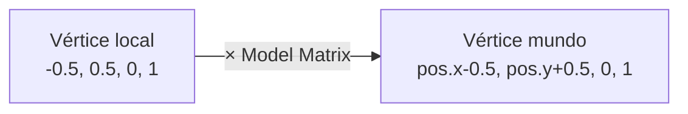

> [!summary]
> La clase `Object3D` encapsula toda la información de un objeto 3D: sus **vértices** (posición + color), sus **índices** (qué vértices forman triángulos), y su **posición** en el mundo. También calcula su propia **matriz de modelo** para transformaciones.
>
> Conceptos clave:
> - Estructura `vertex_t` (posición + color)
> - Vertex list e index list
> - Identificador único por objeto
> - Matriz de modelo (model matrix)

---

## Object3D.h — Header

```cpp
#pragma once
#include "libMath.h"

typedef struct {
    vec4float position;
    vec4float color;
} vertex_t;

class Object3D {
public:
    static inline unsigned int idCounter;
    unsigned int objectId;
    vector<vertex_t> vertexList;
    vector<unsigned int> indexList;
    
    vec4float position = {0, 0, 0, 1};
    Object3D();
    matrix4x4f computeModelMatrix();
    void moveObject(double timeStep);
};
```

---

## La estructura `vertex_t`

```cpp
typedef struct {
    vec4float position;  // {x, y, z, w}
    vec4float color;     // {r, g, b, a}
} vertex_t;
```

Cada vértice almacena **dos atributos**:

| Atributo | Tipo | Descripción |
|----------|------|-------------|
| `position` | `vec4float` | Posición en espacio local `{x, y, z, w}` |
| `color` | `vec4float` | Color RGBA `{r, g, b, a}` |

> [!info] ¿Por qué `vec4float` y no `vec3float`?
> Usamos vectores de **4 componentes** porque las matrices de transformación (4×4) requieren coordenadas homogéneas. La componente `w`:
> - `w = 1` → es un **punto** (se traslada con matrices)
> - `w = 0` → es una **dirección** (no se traslada, solo rota/escala)
>
> Ver más: [[Learn OpenGL/6. Transformations/Vectors|Vectors]]

> [!important] Layout en memoria
> El `struct` tiene un **layout contiguo en memoria**: primero los 4 floats de position, luego los 4 floats de color. Esto es crucial porque OpenGL leerá los datos byte a byte desde la GPU.
>
> ```
> vertex_t en memoria:
> [pos.x][pos.y][pos.z][pos.w][col.r][col.g][col.b][col.a]
>  ←──── 16 bytes ────→←──── 16 bytes ────→
>  ←──────────── sizeof(vertex_t) = 32 bytes ──────────────→
> ```

---

## Object3D.cpp — Implementación

```cpp
#include "Object3D.h"
#include "EventManager.h"

Object3D::Object3D() {
    objectId = idCounter++;
    vertexList = {
        {{-0.5,  0.5, 0, 1 }, { 1, 0, 0, 1}},  // Arriba-izq (rojo)
        {{ 0.5,  0.5, 0, 1 }, { 0, 1, 0, 1}},   // Arriba-der (verde)
        {{-0.5, -0.5, 0, 1 }, { 1, 1, 0, 1}},   // Abajo-izq  (amarillo)
        {{ 0.5, -0.5, 0, 1 }, { 0, 0, 1, 1}}    // Abajo-der  (azul)
    };
    indexList = {0, 1, 2,  2, 1, 3};
}
```

---

### Identificador único

```cpp
static inline unsigned int idCounter;  // Variable compartida entre todos los Object3D
unsigned int objectId;

Object3D::Object3D() {
    objectId = idCounter++;  // Cada objeto recibe un ID único e incremental
}
```

> [!note] ¿Para qué sirve el `objectId`?
> El `Render` usa el `objectId` como **clave** en un `map` para encontrar los buffers GPU asociados a cada objeto:
> ```cpp
> bufferedObjectList[obj->objectId] = bo;  // En setupObject
> auto bo = bufferedObjectList[obj->objectId];  // En drawObjects
> ```
> Así cada objeto tiene su propio VAO/VBO/EBO en la GPU.

---

### Los 4 vértices — Un cuadrado

```cpp
vertexList = {
    {{-0.5,  0.5, 0, 1 }, { 1, 0, 0, 1}},  // v0: Arriba-izq (rojo)
    {{ 0.5,  0.5, 0, 1 }, { 0, 1, 0, 1}},   // v1: Arriba-der (verde)
    {{-0.5, -0.5, 0, 1 }, { 1, 1, 0, 1}},   // v2: Abajo-izq  (amarillo)
    {{ 0.5, -0.5, 0, 1 }, { 0, 0, 1, 1}}    // v3: Abajo-der  (azul)
};
```

Visualización del cuadrado en coordenadas normalizadas:

```
(-0.5, 0.5)          (0.5, 0.5)
     v0 ──────────────── v1
     │ ╲    Triángulo    │
     │   ╲    0,1,2      │
     │     ╲             │
     │       ╲           │
     │  Triángulo  ╲     │
     │    2,1,3      ╲   │
     v2 ──────────────── v3
(-0.5,-0.5)          (0.5,-0.5)
```

> [!info] Coordenadas en NDC
> Los valores van de `-0.5` a `0.5` (dentro del rango visible `-1` a `1` de OpenGL). El cuadrado ocupa la mitad central de la pantalla.
> Ver más: [[Learn OpenGL/7. Coordinate Systems/Clip space|Clip space]]

---

### La lista de índices

```cpp
indexList = {0, 1, 2,  2, 1, 3};
```

OpenGL dibuja **triángulos**, no cuadrados. Un cuadrado se compone de **2 triángulos**:

| Triángulo | Índices | Vértices |
|-----------|---------|----------|
| 1º | `0, 1, 2` | v0 → v1 → v2 |
| 2º | `2, 1, 3` | v2 → v1 → v3 |

> [!important] ¿Por qué usar índices en lugar de repetir vértices?
> Sin índices necesitaríamos **6 vértices** (3 por triángulo, repitiendo v1 y v2). Con índices usamos solo **4 vértices** y le decimos a OpenGL cómo combinarlos.
>
> | Método | Vértices en memoria | Ahorro |
> |--------|-------------------|--------|
> | Sin índices | 6 × 32 bytes = 192 bytes | — |
> | Con índices | 4 × 32 bytes + 6 × 4 bytes = 152 bytes | ~21% |
>
> En modelos complejos con miles de vértices compartidos, el ahorro es **enorme**.
> Ver más: [[Learn OpenGL/3. Hello Triangle/Element Buffer Objects|Element Buffer Objects]]

---

## Matriz de modelo

```cpp
matrix4x4f Object3D::computeModelMatrix() {
    matrix4x4f model = make_translate(position.x, position.y, position.z);
    return model;
}
```

La **model matrix** transforma las coordenadas **locales** del objeto a coordenadas del **mundo**.

> [!info] ¿Qué hace `make_translate`?
> Es una función de nuestra biblioteca `libMath` que genera una matriz de traslación 4×4:
>
> $$
> T = \begin{pmatrix} 1 & 0 & 0 & t_x \\ 0 & 1 & 0 & t_y \\ 0 & 0 & 1 & t_z \\ 0 & 0 & 0 & 1 \end{pmatrix}
> $$
>
> Multiplicar esta matriz por un vértice mueve su posición en $(t_x, t_y, t_z)$.
> Ver más: [[Transformaciones#Matriz de traslación]]
> Ver también: [[Transformaciones#Biblioteca libMath del motor]]

### Flujo de transformación



> [!tip] Extensibilidad
> Actualmente solo se aplica traslación. Para añadir **rotación** y **escala**, se multiplicarían más matrices usando las funciones de `libMath`:
> ```cpp
> model = make_translate(pos.x, pos.y, pos.z) 
>       * make_rotate(angleX, angleY, angleZ) 
>       * make_scale(sx, sy, sz);
> ```
> Ver más sobre las funciones matemáticas: [[Transformaciones#Biblioteca libMath del motor]]
> Ver técnicas avanzadas: [[Learn OpenGL/6. Transformations/Combining matrices|Combining matrices]]
> Ver también: [[Learn OpenGL/6. Transformations/GLM|GLM]]

---

## Movimiento del objeto

```cpp
void Object3D::moveObject(double deltaTime) {
    float speed = 0.5f;
    if (EventManager::keyMap[GLFW_KEY_W]) {
        position.y += speed * deltaTime;
    }
    if (EventManager::keyMap[GLFW_KEY_S]) {
        position.y -= speed * deltaTime;
    }
}
```

Ver explicación detallada en: [[Movimiento de Objetos]]

---

## Relación con otros sistemas

| Quién | Usa Object3D para... |
|-------|---------------------|
| `Render::setupObject` | Leer `vertexList` e `indexList` y subirlos a GPU |
| `Render::drawObjects` | Obtener el `objectId` para buscar buffers |
| `Render::updateObject` | Llamar a `moveObject(deltaTime)` cada frame |
| `main.cpp` | Crear instancias y registrarlas en el Render |

---

## Véase también

- [[Arquitectura del Motor]] — Visión general del proyecto
- [[Buffers (VAO, VBO, EBO)]] — Cómo se suben estos datos a la GPU
- [[Render]] — Cómo se dibujan los objetos
- [[Movimiento de Objetos]] — Detalle del movimiento con delta time
- [[Transformaciones]] — Teoría de matrices y coordenadas homogéneas
- [[Cauce Gráfico]] — El pipeline gráfico que procesa estos datos
