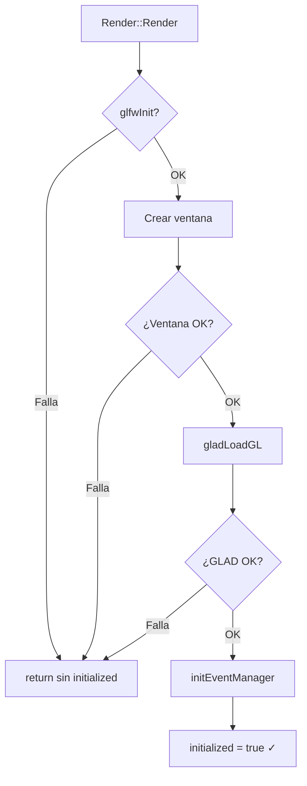
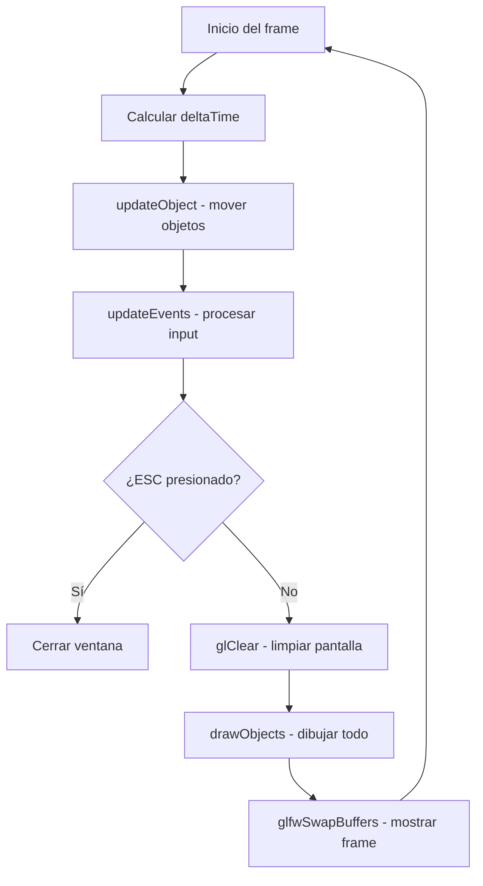

> [!summary]
> La clase `Render` es el **motor gráfico** del proyecto. Se encarga de: inicializar GLFW/GLAD/ventana, subir datos de objetos a la GPU mediante buffers, dibujar todos los objetos registrados, y ejecutar el **game loop** con delta time.
>
> Conceptos clave:
> - Inicialización encapsulada en el constructor
> - Buffer objects (VAO/VBO/EBO) por cada objeto
> - Dibujo con `glDrawElements` (indexed rendering)
> - Game loop con delta time

---

## Render.h — Header

```cpp
#pragma once
#include "Object3D.h"

class Render {
public:
    Render();
    
    typedef struct {
        unsigned int bufferId;        // VAO
        unsigned int vertexBufferId;  // VBO
        unsigned int indexBufferId;   // EBO
    } bufferObject_t;
    
    vector<Object3D*> objectList;
    map<unsigned int, bufferObject_t> bufferedObjectList;
    GLFWwindow* window = nullptr;
    bool initialized = false;
    
    void setupObject(Object3D* obj);
    void drawObjects();
    void updateObject(double timeStep);
    void mainLoop();
};
```

### Miembros importantes

| Miembro | Tipo | Descripción |
|---------|------|-------------|
| `objectList` | `vector<Object3D*>` | Lista de objetos a dibujar cada frame |
| `bufferedObjectList` | `map<uint, bufferObject_t>` | Mapa `objectId → buffers GPU` |
| `window` | `GLFWwindow*` | Ventana de la aplicación |
| `initialized` | `bool` | Flag de inicialización exitosa |

> [!note] `bufferObject_t`
> Agrupa los tres IDs de buffer que OpenGL asigna a cada objeto:
> - `bufferId` → **VAO** (Vertex Array Object)
> - `vertexBufferId` → **VBO** (Vertex Buffer Object)
> - `indexBufferId` → **EBO** (Element Buffer Object)
>
> Ver detalle en: [[Buffers (VAO, VBO, EBO)]]

---

## Constructor — Inicialización

```cpp
Render::Render() {
    initialized = false;
    
    // 1. Inicializar GLFW
    if (!glfwInit()) {
        std::cerr << "ERROR: Failed to initialize glfw" << std::endl;
        return;
    }
    glfwWindowHint(GLFW_RESIZABLE, GL_FALSE);

    // 2. Crear ventana
    this->window = glfwCreateWindow(800, 600, "Hello Triangle", nullptr, nullptr);
    if (!window) {
        std::cerr << "ERROR: Failed to create window" << std::endl;
        glfwTerminate();
        return;
    }
    glfwMakeContextCurrent(window);

    // 3. Inicializar GLAD
    if (!gladLoadGL(glfwGetProcAddress)) {
        std::cerr << "ERROR: Failed to initialize GLAD" << std::endl;
        glfwTerminate();
        return;
    }

    // 4. Registrar eventos
    EventManager::initEventManager(window);
    initialized = true;
}
```

> [!info] Diferencia con la Clase 1
> En la [[Introducción a OpenGL]], este código estaba directamente en `main()`. Ahora está encapsulado en el constructor del `Render`, lo que permite:
> - **Reutilizar** la inicialización
> - **Verificar** el estado con `initialized`
> - Potencialmente crear **múltiples ventanas** (múltiples Render)

### Flujo de inicialización



> [!warning] Manejo de errores
> El constructor usa `return` temprano en lugar de excepciones. El código que usa `Render` debe verificar `initialized` antes de continuar. El `mainLoop()` comprueba esto al inicio.

---

## setupObject — Subir datos a la GPU

```cpp
void Render::setupObject(Object3D *obj) {
    bufferObject_t bo = {0xFFFFFFFF, 0xFFFFFFFF, 0xFFFFFFFF};
    
    // 1. Generar buffers
    glGenVertexArrays(1, &bo.bufferId);       // Crear VAO
    glGenBuffers(1, &bo.indexBufferId);        // Crear EBO
    glGenBuffers(1, &bo.vertexBufferId);       // Crear VBO

    // 2. Bind VAO (todo lo que sigue queda "grabado" en este VAO)
    glBindVertexArray(bo.bufferId);

    // 3. Subir vértices al VBO
    glBindBuffer(GL_ARRAY_BUFFER, bo.vertexBufferId);
    glBufferData(GL_ARRAY_BUFFER, 
                 obj->vertexList.size() * sizeof(vertex_t), 
                 obj->vertexList.data(), 
                 GL_STATIC_DRAW);

    // 4. Subir índices al EBO
    glBindBuffer(GL_ELEMENT_ARRAY_BUFFER, bo.indexBufferId);
    glBufferData(GL_ELEMENT_ARRAY_BUFFER, 
                 sizeof(unsigned int) * obj->indexList.size(), 
                 obj->indexList.data(), 
                 GL_STATIC_DRAW);

    // 5. Guardar la asociación objectId → buffers
    bufferedObjectList[obj->objectId] = bo;
}
```

### Paso a paso

| Paso | Función OpenGL | Qué hace |
|------|----------------|----------|
| 1 | `glGenVertexArrays` / `glGenBuffers` | Pide a OpenGL que reserve IDs para buffers |
| 2 | `glBindVertexArray` | Activa el VAO: todo lo que se configure después queda asociado a él |
| 3 | `glBindBuffer` + `glBufferData` | Copia los vértices de RAM → VRAM (memoria de la GPU) |
| 4 | `glBindBuffer` + `glBufferData` | Copia los índices de RAM → VRAM |
| 5 | `bufferedObjectList[id] = bo` | Guarda los IDs para usarlos al dibujar |

> [!important] `GL_STATIC_DRAW`
> Le indica a OpenGL que estos datos **no van a cambiar** frecuentemente. Esto permite a la GPU optimizar el almacenamiento.
>
> | Hint | Uso típico |
> |------|-----------|
> | `GL_STATIC_DRAW` | Datos que se suben una vez y no cambian |
> | `GL_DYNAMIC_DRAW` | Datos que cambian con frecuencia |
> | `GL_STREAM_DRAW` | Datos que cambian cada frame |

> [!tip] ¿Por qué `0xFFFFFFFF` como valor inicial?
> Es el valor máximo de un `unsigned int`. Se usa como "valor inválido" para detectar si un buffer no se generó correctamente (OpenGL nunca asigna este ID).

Ver explicación detallada de los buffers en: [[Buffers (VAO, VBO, EBO)]]

---

## drawObjects — Dibujar cada frame

```cpp
void Render::drawObjects() {
    for (auto& obj : objectList) {
        // 1. Recuperar buffers de este objeto
        auto bo = bufferedObjectList[obj->objectId];
        
        // 2. Bind de buffers
        glBindVertexArray(bo.bufferId);
        glBindBuffer(GL_ARRAY_BUFFER, bo.vertexBufferId);
        glBindBuffer(GL_ELEMENT_ARRAY_BUFFER, bo.indexBufferId);
        
        // 3. Transformación (legacy OpenGL)
        matrix4x4f model = obj->computeModelMatrix();
        glPushMatrix();
        glLoadIdentity();

        // 4. Configurar atributos de vértice y dibujar
        glEnableClientState(GL_VERTEX_ARRAY);
        glVertexPointer(4, GL_FLOAT, sizeof(vertex_t), 
                       (void*)offsetof(vertex_t, position));
        glDrawElements(GL_TRIANGLES, obj->indexList.size(), 
                      GL_UNSIGNED_INT, nullptr);
        
        // 5. Limpiar estado
        glPopMatrix();
        glDisableClientState(GL_VERTEX_ARRAY);
    }
}
```

### Desglose de `glVertexPointer`

```cpp
glVertexPointer(4, GL_FLOAT, sizeof(vertex_t), (void*)offsetof(vertex_t, position));
```

| Parámetro | Valor | Significado |
|-----------|-------|-------------|
| `size` | `4` | Cada posición tiene 4 componentes (x, y, z, w) |
| `type` | `GL_FLOAT` | Cada componente es un float |
| `stride` | `sizeof(vertex_t)` | Distancia entre un vértice y el siguiente (32 bytes) |
| `pointer` | `offsetof(vertex_t, position)` | Offset del atributo position dentro del struct (0 bytes) |

> [!info] ¿Qué es el stride?
> El **stride** le dice a OpenGL cuántos bytes saltar para llegar al siguiente vértice. Como nuestro `vertex_t` tiene position (16 bytes) + color (16 bytes) = 32 bytes, OpenGL sabe que cada 32 bytes empieza un nuevo vértice.
>
> ```
> Memoria del VBO:
> [pos0][col0][pos1][col1][pos2][col2]...
>  ←─ stride ─→
> ```

### `glDrawElements` — Dibujo indexado

```cpp
glDrawElements(GL_TRIANGLES, obj->indexList.size(), GL_UNSIGNED_INT, nullptr);
```

| Parámetro | Valor | Significado |
|-----------|-------|-------------|
| `mode` | `GL_TRIANGLES` | Cada 3 índices forman un triángulo |
| `count` | `indexList.size()` | Número total de índices (6) |
| `type` | `GL_UNSIGNED_INT` | Tipo de cada índice |
| `indices` | `nullptr` | Los índices ya están en el EBO vinculado |

> [!important] `glDrawElements` vs `glDrawArrays`
> - `glDrawArrays` → dibuja vértices en orden secuencial
> - `glDrawElements` → dibuja usando **índices** (permite reutilizar vértices)
>
> Usamos `glDrawElements` porque nuestro cuadrado comparte vértices entre triángulos.
> Ver más: [[Learn OpenGL/3. Hello Triangle/Element Buffer Objects|Element Buffer Objects]]

---

### Sobre `glPushMatrix` / `glPopMatrix`

```cpp
glPushMatrix();
glLoadIdentity();
// ... dibujar ...
glPopMatrix();
```

> [!warning] API Legacy (Compatibility Profile)
> `glPushMatrix` y `glPopMatrix` son parte del **pipeline fijo** de OpenGL (pre-3.0). Guardan y restauran la matriz de transformación actual para que un objeto no afecte a otro.
>
> En OpenGL moderno esto se reemplaza con **shaders** y **uniforms**.
> Ver más: [[Learn OpenGL/3. Hello Triangle/Vertex Shader|Vertex Shader]]

---

## updateObject — Actualizar lógica

```cpp
void Render::updateObject(double timestep) {
    for (auto& obj : objectList) {
        obj->moveObject(timestep);
    }
}
```

Recorre todos los objetos y les pasa el **delta time** para que actualicen su posición. Ver: [[Movimiento de Objetos]]

---

## mainLoop — El bucle principal

```cpp
void Render::mainLoop() {
    if (!initialized || window == nullptr) {
        return;
    }
    
    double lastTime = 0;
    double newTime = glfwGetTime();
    double deltaTime = newTime - lastTime;

    while (!glfwWindowShouldClose(window))
    {
        // 1. Calcular delta time
        newTime = glfwGetTime();
        deltaTime = newTime - lastTime;
        lastTime = newTime;

        // 2. Actualizar lógica
        updateObject(deltaTime);
        EventManager::updateEvents();

        // 3. Comprobar ESC
        if (EventManager::keyMap[GLFW_KEY_ESCAPE]) {
            glfwSetWindowShouldClose(window, true);
        }

        // 4. Renderizar
        glClear(GL_COLOR_BUFFER_BIT);
        drawObjects();

        // 5. Intercambiar buffers
        glfwSwapBuffers(window);
    }
}
```

Ver explicación detallada del bucle en: [[Game Loop y Delta Time]]

---

## Flujo completo de un frame



---

## Véase también

- [[Arquitectura del Motor]] — Visión general del proyecto
- [[Object3D]] — Los objetos que el Render dibuja
- [[Buffers (VAO, VBO, EBO)]] — Detalle de los buffer objects
- [[Game Loop y Delta Time]] — El patrón del bucle principal
- [[Movimiento de Objetos]] — Cómo se mueven los objetos
