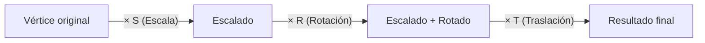

> [!summary]
> Las **transformaciones** son operaciones matemáticas que permiten mover, escalar y rotar objetos en el espacio 3D. Se representan mediante **coordenadas homogéneas** y **matrices 4×4**, que permiten combinar múltiples transformaciones en una sola operación.
>
> Conceptos clave:
> - Coordenadas homogéneas `(x, y, z, w)`
> - Matrices 4×4 para transformaciones
> - Traslación, escalado y rotación
> - Combinación de transformaciones

---

## Fundamentos matemáticos

### Coordenadas homogéneas

Las coordenadas suelen representarse mediante un sistema de **coordenadas homogéneas**, que amplía el espacio euclídeo al espacio proyectivo (se incluyen los puntos impropios o del infinito).

Las coordenadas se representan mediante la tupla $(x, y, z, w)$.

Las coordenadas $(x, y, z)$ del espacio euclídeo se obtienen dividiendo las coordenadas homogéneas entre $w$:

$$\text{Euclídeas} = \left(\frac{x}{w}, \frac{y}{w}, \frac{z}{w}\right)$$

Para $w$, utilizaremos siempre los valores **0** ó **1**:

| Valor de $w$ | Significado | Ejemplo |
|:---:|------------|---------|
| $w = 1$ | Representa un **punto** en el espacio | Posición de un vértice |
| $w = 0$ | Representa una **orientación** (vector/dirección) | Normal, dirección de luz |

> [!important] ¿Por qué importa la diferencia?
> - Un **punto** ($w = 1$) se ve afectado por la traslación: si mueves un objeto, sus vértices se mueven.
> - Una **dirección** ($w = 0$) **no** se ve afectada por la traslación: si mueves un objeto, la dirección "arriba" sigue siendo "arriba".
>
> Esto es consecuencia directa de la multiplicación matricial: la columna de traslación se multiplica por $w$.
> Ver más: [[Learn OpenGL/6. Transformations/Translation|Translation]]
> Ver también: [[Learn OpenGL/6. Transformations/Vectors|Vectors]]

---

### Matrices de transformación

Las librerías de gráficos 3D utilizan la representación matricial de un sistema de coordenadas homogéneas. Se utiliza una **matriz cuadrada de orden 4** para representar las transformaciones.

En OpenGL, las transformaciones se representan mediante la matriz:

$$
M = \begin{pmatrix} m_{00} & m_{01} & m_{02} & m_{03} \\ m_{10} & m_{11} & m_{12} & m_{13} \\ m_{20} & m_{21} & m_{22} & m_{23} \\ m_{30} & m_{31} & m_{32} & m_{33} \end{pmatrix}
$$

> [!note] Column-major en OpenGL
> OpenGL almacena las matrices en **column-major order** (columna por columna en memoria), a diferencia de la notación matemática habitual (row-major).
> Ver más: [[Learn OpenGL/6. Transformations/Matrices|Matrices]]
> Ver también: [[Computer Graphics/2. 2D Graphics/2.3 Transforms/Matrices and Vectors|Matrices and Vectors]]

Para aplicar una transformación a un vértice, se multiplica la matriz por el vector de posición:

$$V' = M \times V$$

> Ver cómo funciona: [[Learn OpenGL/6. Transformations/Matrix-Vector multiplication|Matrix-Vector multiplication]]

---

## Matriz de traslación

La traslación mueve un punto una distancia $(t_x, t_y, t_z)$:

$$
T = \begin{pmatrix} 1 & 0 & 0 & t_x \\ 0 & 1 & 0 & t_y \\ 0 & 0 & 1 & t_z \\ 0 & 0 & 0 & 1 \end{pmatrix}
$$

### Ejercicio: trasladar un punto

¿Cómo trasladamos el punto $(10, 10, 10, 1)$ **10 unidades a la derecha** (eje X)?

$$
T \cdot V = \begin{pmatrix} 1 & 0 & 0 & 10 \\ 0 & 1 & 0 & 0 \\ 0 & 0 & 1 & 0 \\ 0 & 0 & 0 & 1 \end{pmatrix} \cdot \begin{pmatrix} 10 \\ 10 \\ 10 \\ 1 \end{pmatrix} = \begin{pmatrix} 20 \\ 10 \\ 10 \\ 1 \end{pmatrix}
$$

> [!tip] ¿Qué pasa si $w = 0$?
> Si el vector fuera $(10, 10, 10, 0)$ (una dirección), la traslación **no tendría efecto**: la última columna se multiplica por $w = 0$.
> Ver más: [[Learn OpenGL/6. Transformations/Translation|Translation]]
> Ver también: [[Computer Graphics/2. 2D Graphics/2.3 Transforms/Translation|Translation (2D)]]

---

## Matriz de escalado

El escalado multiplica las coordenadas por factores $(s_x, s_y, s_z)$:

$$
S = \begin{pmatrix} s_x & 0 & 0 & 0 \\ 0 & s_y & 0 & 0 \\ 0 & 0 & s_z & 0 \\ 0 & 0 & 0 & 1 \end{pmatrix}
$$

### Ejercicio: escalar un triángulo por 2

Dado un triángulo con vértices:
- $P_1 = (-0.5, -0.5, 0)$
- $P_2 = (0.0, 0.5, 0.0)$
- $P_3 = (0.5, -0.5, 0.0)$

Aplicando escalado uniforme $s = 2$:

$$
S \cdot P_1 = \begin{pmatrix} 2 & 0 & 0 & 0 \\ 0 & 2 & 0 & 0 \\ 0 & 0 & 2 & 0 \\ 0 & 0 & 0 & 1 \end{pmatrix} \cdot \begin{pmatrix} -0.5 \\ -0.5 \\ 0 \\ 1 \end{pmatrix} = \begin{pmatrix} -1.0 \\ -1.0 \\ 0 \\ 1 \end{pmatrix}
$$

```
Antes (s=1):                Después (s=2):
        P2                        P2'
       (0, 0.5)                  (0, 1.0)
       ╱╲                        ╱╲
      ╱  ╲                      ╱  ╲
     ╱    ╲                    ╱    ╲
    ╱──────╲                  ╱──────╲
P1          P3           P1'          P3'
(-0.5,-0.5) (0.5,-0.5)  (-1,-1)      (1,-1)
```

> [!note] Escalado uniforme vs no uniforme
> - **Uniforme**: $s_x = s_y = s_z$ — el objeto mantiene sus proporciones
> - **No uniforme**: factores diferentes — el objeto se deforma
>
> Ver más: [[Learn OpenGL/6. Transformations/Scaling|Scaling]]
> Ver también: [[Computer Graphics/2. 2D Graphics/2.3 Transforms/Scaling|Scaling (2D)]]

---

## Matriz de rotación

La rotación gira un punto alrededor de un eje. Existen tres matrices básicas, una por cada eje:

### Rotación alrededor del eje X

$$
R_x(\theta) = \begin{pmatrix} 1 & 0 & 0 & 0 \\ 0 & \cos\theta & -\sin\theta & 0 \\ 0 & \sin\theta & \cos\theta & 0 \\ 0 & 0 & 0 & 1 \end{pmatrix}
$$

### Rotación alrededor del eje Y

$$
R_y(\theta) = \begin{pmatrix} \cos\theta & 0 & \sin\theta & 0 \\ 0 & 1 & 0 & 0 \\ -\sin\theta & 0 & \cos\theta & 0 \\ 0 & 0 & 0 & 1 \end{pmatrix}
$$

### Rotación alrededor del eje Z

$$
R_z(\theta) = \begin{pmatrix} \cos\theta & -\sin\theta & 0 & 0 \\ \sin\theta & \cos\theta & 0 & 0 \\ 0 & 0 & 1 & 0 \\ 0 & 0 & 0 & 1 \end{pmatrix}
$$

### Ejercicio: rotar 45° respecto al eje X

Rotar el vértice $(10, 10, 10, 1)$ **45°** respecto del eje X:

Con $\cos(45°) = \sin(45°) = \frac{\sqrt{2}}{2} \approx 0.707$:

$$
R_x(45°) \cdot V = \begin{pmatrix} 1 & 0 & 0 & 0 \\ 0 & 0.707 & -0.707 & 0 \\ 0 & 0.707 & 0.707 & 0 \\ 0 & 0 & 0 & 1 \end{pmatrix} \cdot \begin{pmatrix} 10 \\ 10 \\ 10 \\ 1 \end{pmatrix} = \begin{pmatrix} 10 \\ 0 \\ 14.14 \\ 1 \end{pmatrix}
$$

> [!info] Ángulos en radianes
> Las funciones trigonométricas en programación suelen trabajar con **radianes**, no grados. $45° = \frac{\pi}{4}$ radianes.
> Ver más: [[Learn OpenGL/6. Transformations/Rotation|Rotation]]
> Ver también: [[Computer Graphics/2. 2D Graphics/2.3 Transforms/Rotation|Rotation (2D)]]

---

## Combinación de transformaciones

Para aplicar múltiples transformaciones, se **multiplican las matrices** entre sí. El orden importa:

$$M_{final} = T \times R \times S$$

Se aplican de **derecha a izquierda**: primero escala (S), luego rota (R), luego traslada (T).



> [!warning] ¡El orden importa!
> Rotar y luego trasladar ≠ trasladar y luego rotar. La multiplicación de matrices **no es conmutativa**.
>
> ```
> Trasladar luego Rotar:        Rotar luego Trasladar:
> ┌──┐                          ┌──┐
> │  │ ─trasladar→  ┌──┐        │  │ ─rotar→  ╱╲  ─trasladar→  ╱╲
> └──┘               │  │        └──┘         ╱  ╲              ╱  ╲
>       ─rotar→  ╱╲  └──┘
>               ╱  ╲            (resultado diferente)
> ```
>
> Ver más: [[Learn OpenGL/6. Transformations/Combining matrices|Combining matrices]]
> Ver también: [[Learn OpenGL/6. Transformations/Matrix-matrix multiplication|Matrix-matrix multiplication]]
> Ver también: [[Computer Graphics/2. 2D Graphics/2.3 Transforms/Combining Transformations|Combining Transformations (2D)]]

---

## La Model Matrix en nuestro motor

En nuestro motor, `Object3D::computeModelMatrix()` genera la matriz de modelo a partir de la posición:

```cpp
matrix4x4f Object3D::computeModelMatrix() {
    matrix4x4f model = make_translate(position.x, position.y, position.z);
    return model;
}
```

> [!info] Solo traslación por ahora
> Actualmente solo se aplica traslación. Para añadir rotación y escala, se multiplicarían más matrices:
> ```cpp
> model = make_translate(pos.x, pos.y, pos.z) 
>       * make_rotate(angle, axis) 
>       * make_scale(sx, sy, sz);
> ```
> Ver implementación: [[Object3D#Matriz de modelo]]
> Ver más sobre GLM: [[Learn OpenGL/6. Transformations/GLM|GLM]]

---

## La cadena completa de transformación

Las transformaciones se encadenan en el cauce gráfico para pasar de espacio local a pantalla:

$$V_{clip} = M_{projection} \times M_{view} \times M_{model} \times V_{local}$$

| Transformación | Espacio origen | Espacio destino | Responsable |
|---------------|---------------|----------------|-------------|
| **Model Matrix** | Local | Mundo | El objeto (posición, rotación, escala) |
| **View Matrix** | Mundo | Vista (cámara) | La cámara |
| **Projection Matrix** | Vista | Clip | El tipo de proyección |

> Ver la cadena completa: [[Cauce Gráfico#Pipeline completo — De vértices a pantalla]]
> Ver también: [[Learn OpenGL/7. Coordinate Systems/Basic Theory|Basic Theory (Coordinate Systems)]]
> Ver también: [[Learn OpenGL/7. Coordinate Systems/The global picture|The global picture]]
> Ver también: [[Computer Graphics/3. OpenGL Geometry/3.3 Projection and Viewing/Many Coordinate Systems|Many Coordinate Systems]]

---

## La matriz identidad

La **matriz identidad** es el elemento neutro de las transformaciones. Multiplicar un vértice por la identidad no produce ningún cambio:

$$
I = \begin{pmatrix} 1 & 0 & 0 & 0 \\ 0 & 1 & 0 & 0 \\ 0 & 0 & 1 & 0 \\ 0 & 0 & 0 & 1 \end{pmatrix}
$$

> [!note]
> En OpenGL legacy se usa `glLoadIdentity()` para resetear la matriz actual. En OpenGL moderno se construye explícitamente con `glm::mat4(1.0f)`.
> Ver más: [[Learn OpenGL/6. Transformations/Identity Matrix|Identity Matrix]]

---

## Véase también

- [[Cauce Gráfico]] — Donde se aplican estas transformaciones
- [[Object3D]] — La clase que calcula la model matrix
- [[Movimiento de Objetos]] — Traslación con delta time
- [[Learn OpenGL/6. Transformations/Vectors|Vectors]]
- [[Learn OpenGL/6. Transformations/Matrices|Matrices]]
- [[Learn OpenGL/6. Transformations/Translation|Translation]]
- [[Learn OpenGL/6. Transformations/Scaling|Scaling]]
- [[Learn OpenGL/6. Transformations/Rotation|Rotation]]
- [[Learn OpenGL/6. Transformations/Combining matrices|Combining matrices]]
- [[Computer Graphics/3. OpenGL Geometry/3.2 3D Coordinates and Transforms/Basic 3D Transforms|Basic 3D Transforms]]
